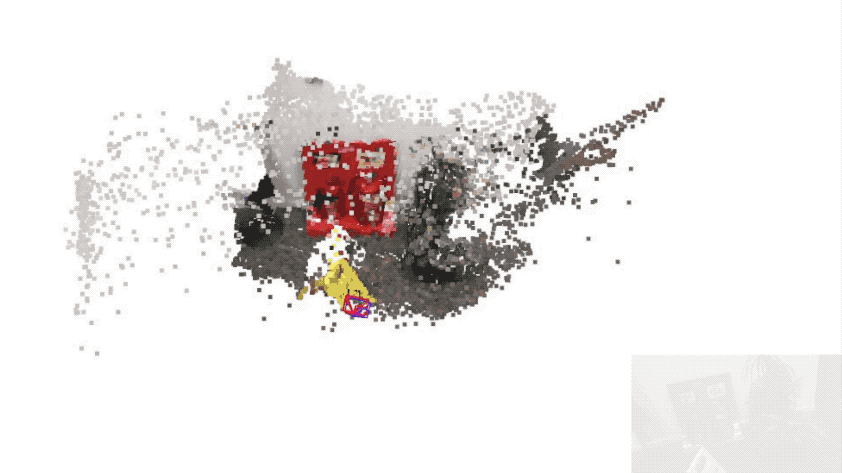
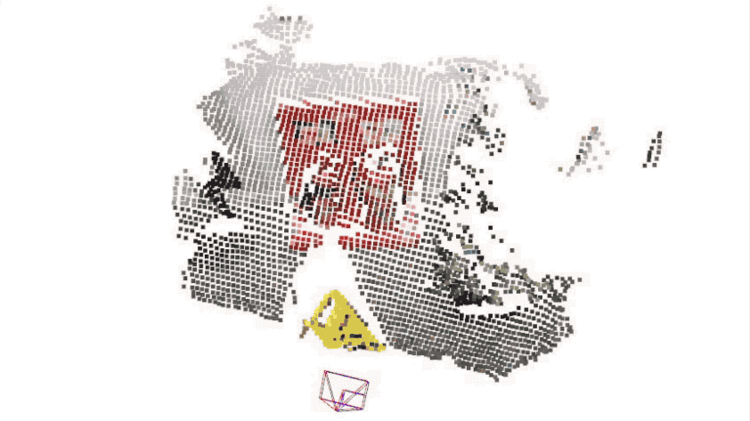

# KFNet
This is a Tensorflow implementation of "Learning Temporal Camera Relocalization using Kalman Filtering".


## About


|| DSAC++ | KFNet |
|:--:|:--:|:--:|
|7scenes-fire       |        |       |
|12scenes-office2-5a|  | |
|Description | Blue - ground truth poses   | Red - estimatd poses |

## Usage

### File format

The input folder of a project should contain the files below.
* `image_list.txt` comprising the sequential full image paths in lines, 
* `label_list.txt` comprising full label paths in lines corresponding to the images. The label files are generated by the `tofile()` function of numpy matrices which store the scene coordinates of pixels. The label maps have a resolution 8 times lower than the images. For example, for the [7scenes dataset](https://www.microsoft.com/en-us/research/project/rgb-d-dataset-7-scenes/), the images have a resolution of 480x640, while the label maps have a resolution of 60x80.
* `transform.txt` records the 4x4 matrix which decorrelates the scene point cloud to give zero mean and correlations.

### Environment

The codes are tested along with python 2.7 and tensorflow-gpu 1.12.

### Testing

```
git checkout KFNet
python KFNet/eval.py --input_folder <input_folder> --output_folder <output_folder> --model_folder <model_folder> --scene <scene>
```


## Credit

This implementation was developed by [Lei Zhou](https://zlthinker.github.io/). Feel free to contact Lei for any enquiry.